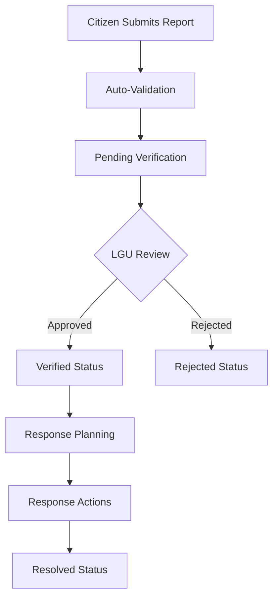

# UDDNRS - Unified Disaster Damage and Needs Reporting System

A comprehensive, reusable disaster reporting system built on ServiceNow platform with React frontend. Designed for government agencies, NGOs, and organizations to standardize disaster damage and needs reporting across different regions and administrative levels.

## 🌟 Key Features

### **Comprehensive Disaster Reporting**
- Standardized digital forms for consistent data collection
- Multi-category damage reporting (structural, infrastructure, agricultural, etc.)
- Severity-based priority assignment
- Geo-tagging with GPS coordinate capture
- Multimedia evidence support (photos/videos)
- Real-time timestamp capture

### **Role-Based Access Control**
- **Citizens**: Submit disaster reports
- **LGU Officers**: Verify reports, manage local jurisdiction
- **National Agencies**: View aggregated data and analytics
- **System Administrators**: Full system management

### **Verification Workflow**
- LGU verification process with status tracking
- Automated notifications for critical reports
- Response tracking and resolution management
- Audit trail for all changes

### **Reusable & Configurable**
- Configurable for different regions and organizations
- Customizable location hierarchies
- Flexible business rules and validation
- Themeable UI components
- Modular architecture

## 📋 System Architecture

```
┌─────────────────┐    ┌────────────────┐    ┌─────────────────┐
│   React.js      │    │  ServiceNow    │    │   ServiceNow    │
│   Frontend      │◄──►│  REST APIs     │◄──►│   Database      │
│                 │    │                │    │                 │
│  - Report Forms │    │  - Validation  │    │  - Tables       │
│  - Lists        │    │  - Workflows   │    │  - Records      │
│  - Analytics    │    │  - Security    │    │  - Attachments  │
└─────────────────┘    └────────────────┘    └─────────────────┘
```

### **ServiceNow Components**

1. **Tables**: Custom disaster report table with comprehensive schema
2. **Business Rules**: Validation, workflow automation, and notifications
3. **ACLs**: Role-based security and data access control
4. **REST APIs**: RESTful endpoints for frontend integration
5. **Roles**: Hierarchical user roles and permissions
6. **Properties**: Configurable system properties
7. **Menus**: Navigation structure for ServiceNow UI

### **React Components**

1. **DisasterReportForm**: Reusable form component with validation
2. **DisasterReportList**: Configurable list with filtering and pagination
3. **UDDNRSConfig**: Configuration utility for customization
4. **DisasterReportService**: API service layer

## 🚀 Quick Start

### **Prerequisites**
- ServiceNow instance with Now SDK support
- Node.js and npm for local development
- ServiceNow developer role access

### **Installation**

1. **Clone or download the application**
2. **Install dependencies**:
   ```bash
   npm install
   ```

3. **Configure your ServiceNow instance** in `now.config.json`

4. **Build and deploy**:
   ```bash
   npm run build
   npm run deploy
   ```

5. **Access the application** via the UDDNRS menu in ServiceNow

## ⚙️ Configuration

The system is highly configurable through the `UDDNRSConfig` utility:

### **Basic Configuration**

```javascript
import { UDDNRSConfig } from './utils/UDDNRSConfig'

const customConfig = UDDNRSConfig.createCustomConfig({
    systemName: 'Your Organization Disaster Reporting',
    organizationName: 'Your Organization Name',
    defaultRegion: 'Your Region',
    theme: {
        primaryColor: '#your-color'
    }
})
```

### **Location Hierarchy**

Customize the administrative boundaries:

```javascript
const locationHierarchy = {
    'Your Country': {
        'Region 1': {
            'Province A': ['City 1', 'City 2'],
            'Province B': ['City 3', 'City 4']
        }
    }
}
```

### **Form Configuration**

```javascript
const formConfig = {
    enableGeoLocation: true,
    requireGeoLocation: false,
    maxFileSize: 10, // MB
    allowedFileTypes: ['image/*', 'video/*']
}
```

### **System Properties**

Configure through ServiceNow properties table or directly:

- `x_2002275_unified.enable_geo_validation`: Enable GPS coordinate validation
- `x_2002275_unified.auto_priority_assignment`: Auto-assign priority levels
- `x_2002275_unified.max_reports_per_user_per_day`: Daily report limits
- `x_2002275_unified.notification_enabled`: Enable notifications

## 🎯 Use Cases & Examples

### **1. Regional Government Deployment**

```javascript
const RegionalConfig = UDDNRSConfig.createCustomConfig({
    systemName: 'Regional Disaster Assessment System',
    organizationName: 'Regional Government',
    defaultRegion: 'Region IV-A',
    form: {
        requireGeoLocation: true,
        enableMultimedia: true
    }
})
```

### **2. City-Level Implementation**

```javascript
const CityConfig = UDDNRSConfig.createCustomConfig({
    systemName: 'City Disaster Reporting Portal',
    organizationName: 'City Government',
    coordinateBounds: {
        // City-specific GPS bounds
        minLat: 14.54, maxLat: 14.57,
        minLng: 121.01, maxLng: 121.05
    }
})
```

### **3. NGO Customization**

```javascript
const NGOConfig = UDDNRSConfig.createCustomConfig({
    systemName: 'Community Assessment Tool',
    organizationName: 'Philippine Red Cross',
    theme: { primaryColor: '#dc3545' },
    notifications: { criticalReportAlert: true }
})
```

## 📊 Data Structure

### **Disaster Report Fields**

| Field | Type | Description |
|-------|------|-------------|
| `number` | String | Auto-generated report number (DR0001000+) |
| `reporter_name` | String | Name of person submitting report |
| `reporter_type` | Choice | citizen, lgu_officer, national_agency |
| `reporter_contact` | String | Email/phone contact information |
| `location_description` | String | Detailed location description |
| `region` | String | Administrative region |
| `province` | String | Province/state |
| `municipality` | String | Municipality/city |
| `barangay` | String | Barangay/district |
| `latitude/longitude` | Decimal | GPS coordinates |
| `damage_type` | Choice | Type of damage reported |
| `damage_severity` | Choice | Severity assessment (minimal, moderate, severe, catastrophic) |
| `damage_description` | Text | Detailed damage description |
| `affected_households` | Integer | Number of affected households |
| `affected_individuals` | Integer | Number of affected individuals |
| `immediate_needs` | Text | Description of immediate needs |
| `verification_status` | Choice | pending, verified, rejected, resolved |
| `priority_level` | Choice | low, medium, high, critical (for response prioritization) |
| `has_multimedia` | Boolean | Whether attachments are present |

### **Field Mapping for UI Components**

The frontend normalizes database fields for consistent UI interaction:

```javascript
// Service layer mapping (DisasterReportService.js)
normalizedReport.severity = report.priority_level        // UI severity filter uses priority_level
normalizedReport.status = report.verification_status     // UI status filter uses verification_status
```

**Important**: Frontend filters (`ReportsPage`, `DisasterReportList`) use these normalized fields:
- **Severity filtering**: Maps to `priority_level` (low, medium, high, critical)
- **Status filtering**: Maps to `verification_status` (pending, verified, rejected, resolved)

This ensures consistency between what users see in the UI and the actual database values.

## 🔐 Security & Permissions

### **Role Hierarchy**

```
Admin (Full Access)
├── National Agency (Analytics + View All)
├── LGU Officer (Verify + Manage Local)
└── Citizen (Submit Only)
```

### **Access Control Lists (ACLs)**

- **Create**: All authenticated users
- **Read**: Based on role and location
- **Update**: Role-based field restrictions
- **Delete**: Administrators only
- **Verification Fields**: LGU Officers and Admins only

## 🔄 Workflow Process



## 📈 Analytics & Reporting

- **Aggregated Data**: By region, damage type, severity
- **Response Metrics**: Time tracking and performance
- **Dashboard Views**: Real-time status and trends
- **Export Capabilities**: Data export for external analysis

## � Recent Updates & Fixes

### **Data Mismatch Resolution (v1.x)**

Fixed critical data consistency issues in the Reports filtering module:

#### **Severity Filter Alignment**
- **Issue**: UI filter displayed "Low, Medium, High" but database held different values
- **Fix**: Mapped severity filter to `priority_level` field instead of `damage_severity`
  - Filter now correctly uses: `low`, `medium`, `high`, `critical`
  - Database field `damage_severity` remains for damage assessment (minimal, moderate, severe, catastrophic)
  - See [DisasterReportService.js](src/client/services/DisasterReportService.js) line ~181

#### **Status Filter Alignment**
- **Issue**: UI filter showed "New, In Progress, Resolved, Closed" but database used different values
- **Fix**: Updated filter dropdown to match actual `verification_status` values
  - Filter now correctly uses: `pending`, `verified`, `rejected`, `resolved`
  - Removed case-sensitivity workarounds in filter logic
  - See [ReportsPage.jsx](src/client/components/ReportsPage.jsx) filtering logic

#### **Badge Function Updates**
- Updated `getStatusBadge()` to display correct labels for new status values
- Updated `getSeverityBadge()` to support critical priority level
- Summary cards now accurately reflect report counts

**Files Modified:**
- `src/client/services/DisasterReportService.js` - Field mapping normalization
- `src/client/components/ReportsPage.jsx` - Filter options and badge rendering

## �🛠️ Customization Guide

### **Adding New Damage Types**

1. Update `UDDNRSConfig.damageTypes`
2. Modify table choices in `disaster-report.now.ts`
3. Update validation rules if needed

### **Custom Business Rules**

```javascript
import { BusinessRule } from '@servicenow/sdk/core'
import { customValidation } from '../server/custom-validation.js'

BusinessRule({
    name: 'Custom Validation Rule',
    table: 'x_2002275_unified_disaster_report',
    when: 'before',
    action: ['insert', 'update'],
    script: customValidation
})
```

### **Theme Customization**

```javascript
const customTheme = {
    primaryColor: '#your-primary-color',
    secondaryColor: '#your-secondary-color',
    successColor: '#your-success-color'
}
```

## 🔧 Development

### **Local Development**

```bash
# Start local development
npm run build -- --watch

# Deploy to instance
npm run deploy

# Run diagnostics
npm run types
```

### **File Structure**

```
src/
├── client/                 # React frontend
│   ├── components/        # Reusable UI components
│   ├── services/         # API service layers
│   └── utils/            # Configuration utilities
├── fluent/               # ServiceNow metadata
│   ├── tables/          # Table definitions
│   ├── business-rules/  # Business logic
│   ├── acls/           # Security rules
│   ├── rest-apis/      # API endpoints
│   ├── roles/          # User roles
│   ├── properties/     # System configuration
│   └── menus/          # Navigation structure
└── server/              # Server-side scripts
    ├── validation/     # Validation logic
    └── workflows/      # Workflow automation
```

## 📞 Support & Contributing

### **Common Issues**
- **GPS not working**: Check browser permissions and HTTPS
- **File uploads failing**: Verify file size and type restrictions
- **Permission errors**: Review user roles and ACL configurations

### **Best Practices**
- Test configuration changes in development first
- Backup data before major updates
- Monitor system performance with large datasets
- Regular security reviews of access permissions

### **Contributing**
1. Fork the repository
2. Create feature branches
3. Add comprehensive tests
4. Submit pull requests with detailed descriptions

## 📄 License

This project is licensed under the ServiceNow Partner License. See LICENSE file for details.

---

**Built with ❤️ for disaster preparedness and response communities worldwide.**